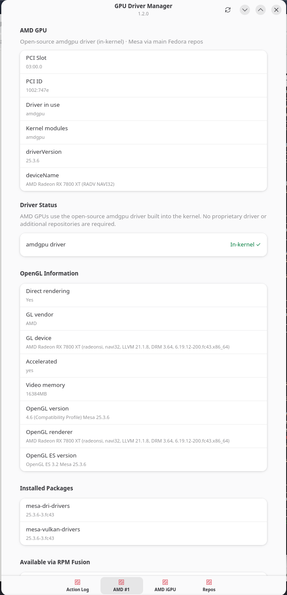

# fedora-gpu-manager

A native GTK4/libadwaita GPU driver detection and management tool for Fedora 44+.

Inspired by Linux Mint's Driver Manager, built for Fedora with a proper Adwaita UI and no Python runtime dependency.



## Features

- Detects **NVIDIA**, **AMD** (discrete + integrated), and **Intel** GPUs via `lspci`
- Shows active kernel driver and kernel modules per GPU
- Lists installed driver packages with versions
- Queries RPM Fusion repositories for available packages
- **RPM Fusion install** — one-click install of free + nonfree repos via `pkexec`
- **NVIDIA driver install** — installs `akmod-nvidia` and supporting packages via `pkexec`
- Distinguishes integrated vs discrete GPUs (AMD iGPU, Intel iGPU)
- Vendor-appropriate messaging — AMD and Intel users told no action needed
- Action Log tab streams all pkexec output in real time
- Fast startup — scanning runs in a background thread
- Single compiled binary, no Python/Ruby runtime required

## Screenshots

| GPU Detection | Repo Management |
|---|---|
| NVIDIA GPU with driver status | RPM Fusion install and status |

## Requirements

### Runtime
- Fedora 44+
- `libadwaita` (usually pre-installed with GNOME)
- `gtk4` (usually pre-installed with GNOME)
- `pciutils` (provides `lspci`, usually pre-installed)
- `polkit` (provides `pkexec`, usually pre-installed)

### Build
```bash
sudo dnf install -y rust cargo gtk4-devel libadwaita-devel pkg-config gcc
```

## Building

```bash
git clone https://github.com/rxmccaf/fedora-gpu-manager.git
cd fedora-gpu-manager
cargo build --release
./target/release/fedora-gpu-manager
```

## Installing (manual)

```bash
sudo install -Dm755 target/release/fedora-gpu-manager /usr/local/bin/fedora-gpu-manager
```

## GPU Support Matrix

| Vendor | Detection | Driver Info | Install Driver | Notes |
|--------|-----------|-------------|----------------|-------|
| NVIDIA | ✅ | ✅ | ✅ akmod-nvidia | Requires RPM Fusion nonfree |
| AMD Discrete | ✅ | ✅ | N/A | amdgpu in-kernel, no install needed |
| AMD Integrated | ✅ | ✅ | N/A | Identified as iGPU automatically |
| Intel Integrated | ✅ | ✅ | N/A | i915/xe in-kernel, no install needed |

## RPM Fusion

This tool can install and configure RPM Fusion repositories:
- **rpmfusion-free** — open-source packages (Mesa, ROCm)
- **rpmfusion-nonfree** — proprietary drivers (akmod-nvidia)

All privileged operations use `pkexec` and prompt for authentication.

## Limitations (v1.0)

- Legacy NVIDIA drivers (390xx, 470xx series) are not managed — planned for a future release
- CUDA and ROCm toolchain packages are out of scope by design — advanced users who need these don't need a GUI
- Intel Arc discrete GPU support not yet tested
- Vulkan device info is system-wide, not per-GPU

## Roadmap

**v1.1**
- Legacy NVIDIA driver detection and install (390xx, 470xx) — needs tester hardware

**v1.2**
- `glxinfo -B` output on GPU pages (OpenGL renderer, version, direct rendering status)
- Per-device Vulkan info

**v2.0**
- COPR/Fedora package submission

## License

GPLv3+ — see [LICENSE](LICENSE)

## Author

Ray McCaffity
